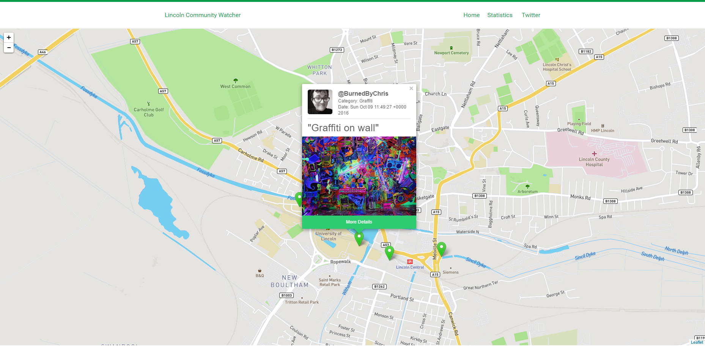

# Lincoln Hack

## Demo
[Demo Site](https://burnsy.github.io/LincolnHack/)
## Description 

Our hack won [Epix Media](https://www.epixmedia.co.uk/blog/up-all-night-to-get-hacky/) challenge. It was made during [Lincoln Hack](lincolnhack.org) 2016, a 24hr Hackathon in Lincoln, England. The hack was started out of the challenge to "Hack for the good of a community or group of people"

Using the Twitter API to store the data, We created a Map based system that loads markers based upon tweets, that have longitude and latitude!

### Tweet Template
"#LincolnCommunityWatch Category: [Category], Description: [Description], Position: [Longitude],[Latitude]" optional: photo attached

### Example Tweet
"#LincolnCommunityWatch Category: Graffiti, Description: Graffiti on wall, Position: -0.545291,53.227254"

## Requirements

To run this project, you must have installed:

- Node & npm
- PHP (or hhvm)

This project makes use of **Twitter's API**, so make sure you [sign up](https://dev.twitter.com) for a developer account!
